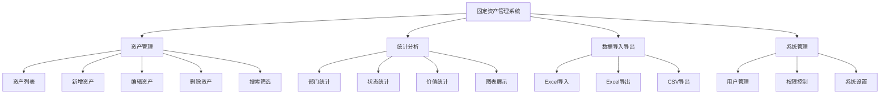
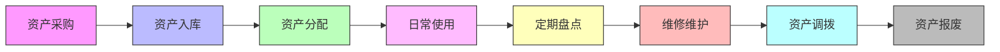
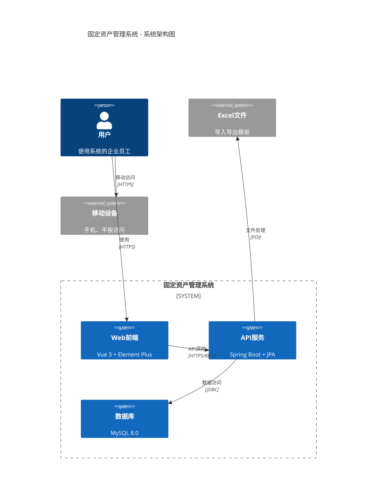
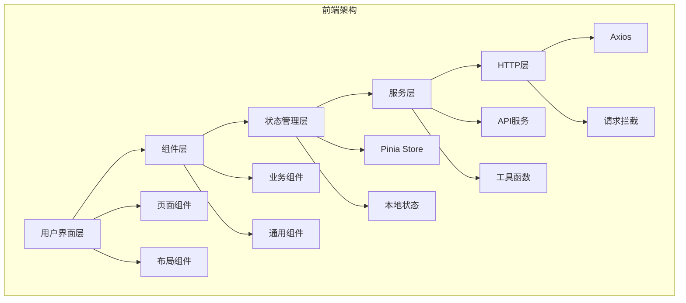
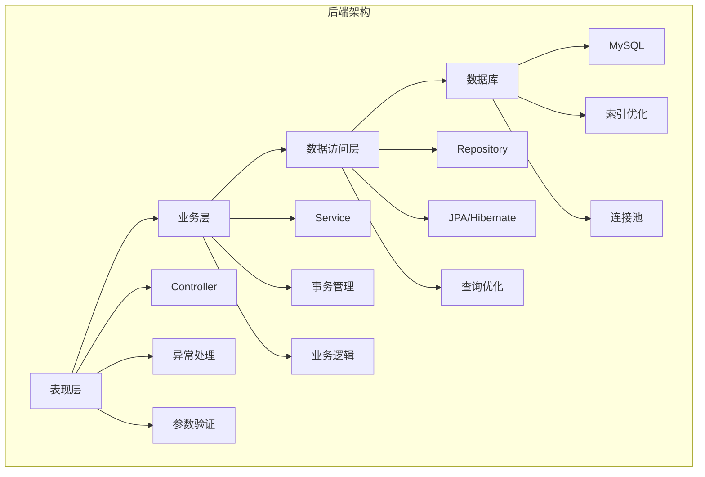
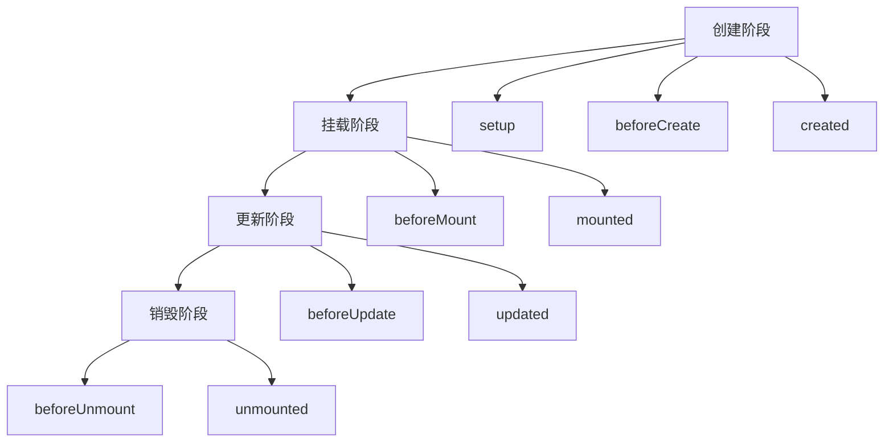

# 📚 固定资产管理系统开发完全指南

> **一本从零基础到项目实战的完整教程**

## 📖 前言

### 为什么写这本书？

本书旨在帮助开发者从零开始，全面掌握固定资产管理系统的开发技术。无论您是前端新手、后端初学者，还是全栈开发者，都能从本书中获得实用的知识和技能。

### 本书特色

- 🎯 **实战导向** - 以真实项目为例，学以致用
- 📚 **循序渐进** - 从基础到高级，层次分明
- 🔧 **技术全面** - 涵盖前后端完整技术栈
- 💡 **最佳实践** - 包含企业级开发经验
- 🎨 **图文并茂** - 丰富的代码示例和图解

### 适合读者

- Vue.js 初学者
- Spring Boot 入门者
- 全栈开发学习者
- 企业管理系统开发者
- 计算机科学学生

### 学习收获

完成本书学习后，您将能够：

✅ 独立开发企业级管理系统
✅ 掌握前后端分离架构
✅ 熟练使用主流开发框架
✅ 理解企业级项目结构
✅ 具备项目部署运维能力

---

## 📚 目录

### 第一部分：项目概述与环境搭建

- [第1章：项目简介](#第1章项目简介)
- [第2章：开发环境搭建](#第2章开发环境搭建)
- [第3章：项目初始化](#第3章项目初始化)

### 第二部分：前端开发详解

- [第4章：Vue 3 基础入门](#第4章vue-3-基础入门)
- [第5章：组件化开发](#第5章组件化开发)
- [第6章：状态管理与路由](#第6章状态管理与路由)
- [第7章：API 接口调用](#第7章api-接口调用)
- [第8章：Element Plus 组件库](#第8章element-plus-组件库)
- [第9章：数据可视化图表](#第9章数据可视化图表)

### 第三部分：后端开发详解

- [第10章：Spring Boot 基础](#第10章spring-boot-基础)
- [第11章：数据库设计与JPA](#第11章数据库设计与jpa)
- [第12章：RESTful API 设计](#第12章restful-api-设计)
- [第13章：异常处理机制](#第13章异常处理机制)
- [第14章：文件处理（Excel）](#第14章文件处理excel)
- [第15章：事务管理与性能优化](#第15章事务管理与性能优化)

### 第四部分：项目实战

- [第16章：资产管理模块实现](#第16章资产管理模块实现)
- [第17章：统计报表模块实现](#第17章统计报表模块实现)
- [第18章：导入导出功能实现](#第18章导入导出功能实现)
- [第19章：系统测试](#第19章系统测试)
- [第20章：项目部署上线](#第20章项目部署上线)

### 第五部分：进阶主题

- [第21章：安全加固](#第21章安全加固)
- [第22章：性能优化](#第22章性能优化)
- [第23章：监控与日志](#第23章监控与日志)
- [第24章：微服务架构](#第24章微服务架构)
- [第25章：项目扩展与重构](#第25章项目扩展与重构)

---

## 第一部分：项目概述与环境搭建

### 第1章：项目简介

#### 1.1 什么是固定资产管理系统？

固定资产管理系统是企业管理中不可或缺的重要工具。它帮助企业：

- 📊 **全面掌控资产** - 实时了解资产数量、状态、位置
- 💰 **精确核算价值** - 准确计算资产原值、净值、折旧
- 🔄 **规范资产管理** - 标准化资产新增、调拨、报废流程
- 📈 **辅助决策分析** - 提供数据支持，优化资产配置

#### 1.2 系统功能模块

##### 1.2.1 核心功能



##### 1.2.2 业务流程



#### 1.3 技术选型分析

##### 1.3.1 为什么选择 Vue 3？

```javascript
// Vue 3 的优势
const vue3Advantages = {
  performance: "性能提升40%，包体积减少41%",
  composition: "Composition API 提供更好的逻辑复用",
  typescript: "完整的TypeScript支持",
  reactivity: "Proxy响应式系统，更精确的数据监听",
  ecosystem: "成熟的生态系统，丰富的第三方库"
};
```

**核心优势：**

1. ⚡ **性能卓越** - Virtual DOM优化，渲染更快
2. 🧩 **组件化** - 高度模块化，易于维护
3. 📱 **响应式** - 数据驱动视图，开发更直观
4. 🎨 **灵活性** - 渐进式框架，可大可小
5. 🌍 **生态丰富** - 大量优质组件库和工具

##### 1.3.2 为什么选择 Spring Boot？

```java
// Spring Boot 的优势
public class SpringBootAdvantages {
    private String autoConfiguration = "自动配置，开箱即用";
    private String embeddedServer = "内置Tomcat，无需外部服务器";
    private String productionReady = "生产就绪特性，监控、健康检查";
    private String microservices = "微服务架构支持";
    private String ecosystem = "庞大的Spring生态系统";
}
```

**核心优势：**

1. 🚀 **快速开发** - 约定优于配置，快速搭建应用
2. 🛡️ **企业级** - 成熟稳定，适合大型项目
3. 🔧 **功能丰富** - 安全、事务、缓存等一应俱全
4. 📊 **监控完善** - Actuator提供完整监控能力
5. ☁️ **云原生** - 完美支持容器化和微服务

##### 1.3.3 技术栈对比

| 技术选项 | 优势 | 劣势 | 适用场景 |
|---------|------|------|---------|
| **Vue 3** | 轻量、灵活、易学 | 相对年轻，部分库不成熟 | SPA应用、管理后台 |
| **React** | 生态庞大、社区活跃 | 学习曲线陡峭 | 复杂交互应用 |
| **Angular** | 完整解决方案、TypeScript友好 | 学习成本高、包体积大 | 大型企业应用 |
| **Spring Boot** | 企业级、功能完善 | 配置相对复杂 | 后端服务、微服务 |
| **Express** | 轻量、灵活 | 功能相对简单 | API服务、小型应用 |

#### 1.4 项目架构设计

##### 1.4.1 整体架构



##### 1.4.2 前端架构



##### 1.4.3 后端架构



### 第2章：开发环境搭建

#### 2.1 硬件要求

##### 2.1.1 最低配置
- CPU: 双核处理器 2.0GHz
- 内存: 8GB RAM
- 硬盘: 100GB 可用空间
- 网络: 稳定的网络连接

##### 2.1.2 推荐配置
- CPU: 四核处理器 3.0GHz+
- 内存: 16GB RAM+
- 硬盘: 256GB SSD+
- 显示器: 1920x1080 分辨率

#### 2.2 软件环境

##### 2.2.1 操作系统

**Windows 10/11**
```powershell
# 检查系统版本
systeminfo | findstr /B /C:"OS 名称" /C:"OS 版本"

# 启用WSL2（可选，推荐）
wsl --install
```

**macOS**
```bash
# 检查系统版本
sw_vers

# 安装Homebrew（包管理器）
/bin/bash -c "$(curl -fsSL https://raw.githubusercontent.com/Homebrew/install/HEAD/install.sh)"
```

**Linux (Ubuntu/Debian)**
```bash
# 检查系统版本
lsb_release -a

# 更新系统
sudo apt update && sudo apt upgrade -y
```

##### 2.2.2 开发工具安装

**1. Node.js 安装**

```bash
# 使用nvm安装（推荐）
# 安装nvm
curl -o- https://raw.githubusercontent.com/nvm-sh/nvm/v0.39.0/install.sh | bash

# 重新加载shell配置
source ~/.bashrc  # Linux/macOS
# 或重新启动终端

# 安装Node.js 16+
nvm install 16
nvm use 16

# 验证安装
node --version  # 应该显示 v16.x.x
npm --version   # 应该显示 8.x.x
```

**2. JDK 8+ 安装**

```bash
# Ubuntu/Debian
sudo apt install openjdk-11-jdk

# CentOS/RHEL
sudo yum install java-11-openjdk-devel

# macOS (使用Homebrew)
brew install openjdk@11

# 验证安装
java --version
javac --version
```

**3. Maven 安装**

```bash
# Ubuntu/Debian
sudo apt install maven

# CentOS/RHEL
sudo yum install maven

# macOS
brew install maven

# 验证安装
mvn --version
```

**4. MySQL 8.0+ 安装**

```bash
# Ubuntu/Debian
sudo apt install mysql-server

# CentOS/RHEL
sudo yum install mysql-server

# macOS
brew install mysql

# 启动MySQL服务
sudo systemctl start mysql  # Linux
brew services start mysql   # macOS

# 安全配置
sudo mysql_secure_installation
```

**5. 开发工具**

**Visual Studio Code**
```bash
# 推荐插件
- Volar (Vue 3支持)
- ESLint (代码检查)
- Prettier (代码格式化)
- Java Extension Pack (Java开发)
- Spring Boot Extension Pack (Spring开发)
- MySQL (数据库工具)
```

**IntelliJ IDEA**
```bash
# 推荐插件
- Vue.js (Vue开发支持)
- Spring Assistant (Spring开发)
- Database Tools (数据库工具)
- Git Integration (版本控制)
```

#### 2.3 环境变量配置

##### 2.3.1 Windows环境变量

```batch
# 设置JAVA_HOME
setx JAVA_HOME "C:\Program Files\Java\jdk-11"
setx PATH "%PATH%;%JAVA_HOME%\bin"

# 设置MAVEN_HOME  
setx MAVEN_HOME "C:\Program Files\Apache\maven"
setx PATH "%PATH%;%MAVEN_HOME%\bin"
```

##### 2.3.2 Linux/macOS环境变量

```bash
# 编辑 ~/.bashrc 或 ~/.zshrc
export JAVA_HOME=/usr/lib/jvm/java-11-openjdk
export MAVEN_HOME=/opt/maven
export PATH=$PATH:$JAVA_HOME/bin:$MAVEN_HOME/bin

# 使配置生效
source ~/.bashrc
```

#### 2.4 开发环境验证

##### 2.4.1 验证命令

```bash
# 验证Node.js
node --version
npm --version

# 验证Java
java --version
javac --version

# 验证Maven
mvn --version

# 验证MySQL
mysql --version
mysql -u root -p -e "SELECT VERSION();"
```

##### 2.4.2 创建测试项目

**前端测试**
```bash
# 创建Vue项目测试
npm create vite@latest test-vue -- --template vue
cd test-vue
npm install
npm run dev
```

**后端测试**
```bash
# 创建Spring Boot项目测试
mvn archetype:generate \
  -DarchetypeGroupId=org.apache.maven.archetypes \
  -DarchetypeArtifactId=maven-archetype-quickstart \
  -DarchetypeVersion=1.4 \
  -DgroupId=com.test \
  -DartifactId=test-spring \
  -Dversion=1.0.0 \
  -Dpackage=com.test
```

### 第3章：项目初始化

#### 3.1 获取项目代码

```bash
# 克隆项目
cd /soft/excl
ls -la

# 项目结构
├── optimized-backend/          # 优化后端（Spring Boot）
├── optimized-frontend/         # 优化前端（Vue 3）
├── assets/                     # 资源文件
├── create_database.sql         # 数据库脚本
└── create_optimized_database.sql # 优化数据库脚本
```

#### 3.2 数据库初始化

##### 3.2.1 创建数据库

```sql
-- 登录MySQL
mysql -u root -p

-- 创建数据库
CREATE DATABASE asset_management 
  CHARACTER SET utf8mb4 
  COLLATE utf8mb4_unicode_ci;

-- 创建用户并授权（生产环境推荐）
CREATE USER 'asset_user'@'localhost' IDENTIFIED BY 'secure_password';
GRANT ALL PRIVILEGES ON asset_management.* TO 'asset_user'@'localhost';
FLUSH PRIVILEGES;

-- 使用数据库
USE asset_management;
```

##### 3.2.2 导入表结构

```bash
# 导入优化版数据库脚本
mysql -u root -p asset_management < create_optimized_database.sql

# 验证表结构
mysql -u root -p -e "
USE asset_management;
SHOW TABLES;
DESCRIBE fixed_assets;
SELECT COUNT(*) as '资产总数' FROM fixed_assets;
"
```

##### 3.2.3 数据库设计详解

```sql
-- 查看完整的表结构
SHOW CREATE TABLE fixed_assets\G

-- 查看索引信息
SHOW INDEX FROM fixed_assets;

-- 查看示例数据
SELECT * FROM fixed_assets LIMIT 5;
```

#### 3.3 后端项目初始化

##### 3.3.1 项目结构分析

```bash
cd optimized-backend
find src -type f -name "*.java" | head -20

# 项目结构
src/main/java/com/assetmanagement/
├── AssetManagementApplication.java      # 启动类
├── controller/                         # 控制器
├── service/                           # 服务层
├── repository/                        # 数据访问
├── entity/                           # 实体类
├── dto/                             # 数据传输对象
└── exception/                       # 异常处理
```

##### 3.3.2 配置文件详解

```yaml
# application.yml 详细配置说明
server:
  port: 8080                    # 服务端口
  servlet:
    context-path: /            # 上下文路径

spring:
  application:
    name: asset-management     # 应用名称
  
  datasource:                 # 数据库配置
    driver-class-name: com.mysql.cj.jdbc.Driver
    url: jdbc:mysql://localhost:3306/asset_management?useUnicode=true&characterEncoding=utf8&useSSL=false&serverTimezone=UTC&allowPublicKeyRetrieval=true
    username: root
    password: rootroot
    hikari:                   # 连接池配置
      minimum-idle: 5
      maximum-pool-size: 20
      idle-timeout: 300000
      max-lifetime: 1200000
      connection-timeout: 20000
  
  jpa:                       # JPA配置
    database-platform: org.hibernate.dialect.MySQL8Dialect
    hibernate:
      ddl-auto: update       # 自动更新表结构
    show-sql: false          # 是否显示SQL
    properties:
      hibernate:
        format_sql: true     # SQL格式化
  
  servlet:
    multipart:              # 文件上传配置
      enabled: true
      max-file-size: 10MB
      max-request-size: 10MB

logging:                   # 日志配置
  level:
    com.assetmanagement: DEBUG
    org.springframework.web: INFO
  file:
    name: ./logs/application.log
```

##### 3.3.3 编译和运行

```bash
# 清理和编译
mvn clean compile

# 运行测试
mvn test

# 打包应用
mvn clean package

# 运行应用
java -jar target/fixed-asset-system-1.0.0.jar

# 或者使用Maven运行
mvn spring-boot:run
```

#### 3.4 前端项目初始化

##### 3.4.1 项目结构分析

```bash
cd optimized-frontend
ls -la src/

# 前端项目结构
src/
├── api/                    # API接口封装
├── components/            # 可复用组件
├── views/                 # 页面组件
├── router/                # 路由配置
├── App.vue               # 根组件
└── main.js               # 应用入口
```

##### 3.4.2 依赖安装

```bash
# 查看package.json依赖
cat package.json

# 安装依赖
npm install

# 如果遇到依赖问题，可以尝试
npm cache clean --force
rm -rf node_modules package-lock.json
npm install
```

##### 3.4.3 配置文件详解

```javascript
// vite.config.js 配置说明
import { defineConfig } from 'vite'
import vue from '@vitejs/plugin-vue'
import path from 'path'

export default defineConfig({
  plugins: [vue()],
  
  resolve: {
    alias: {
      '@': path.resolve(__dirname, 'src')  // 路径别名
    }
  },
  
  server: {
    port: 3000,                           // 开发服务器端口
    host: '0.0.0.0',                      // 监听所有地址
    
    proxy: {                              // 代理配置
      '/api': {
        target: 'http://localhost:8080',  // 后端地址
        changeOrigin: true,               // 改变源
        secure: false                     // 不验证SSL
      }
    }
  },
  
  build: {
    outDir: 'dist',                       // 输出目录
    sourcemap: false,                     // 不生成sourcemap
    
    rollupOptions: {
      output: {
        manualChunks: {                   // 代码分割
          vendor: ['vue', 'vue-router', 'pinia', 'axios'],
          element: ['element-plus'],
          echarts: ['echarts']
        }
      }
    }
  }
})
```

##### 3.4.4 启动开发服务器

```bash
# 启动开发服务器
npm run dev

# 构建生产版本
npm run build

# 预览生产构建
npm run preview
```

#### 3.5 项目启动验证

##### 3.5.1 后端启动验证

```bash
# 检查后端是否启动成功
curl -I http://localhost:8080/api/assets

# 测试API接口
curl -X GET http://localhost:8080/api/assets

# 查看日志
tail -f logs/application.log
```

##### 3.5.2 前端启动验证

```bash
# 检查前端是否启动成功
curl -I http://localhost:3000

# 或者直接在浏览器中访问
# http://localhost:3000
```

##### 3.5.3 完整功能测试

1. **访问前端页面** - 打开 http://localhost:3000
2. **查看资产列表** - 确认数据正常显示
3. **测试搜索功能** - 输入关键词测试搜索
4. **测试新增资产** - 添加一条新资产记录
5. **测试编辑功能** - 修改现有资产信息
6. **测试删除功能** - 删除一条资产记录
7. **查看统计页面** - 切换到统计报表页面
8. **测试导入导出** - 尝试Excel导入导出功能

---

> **第一部分结束**

恭喜您完成了项目环境的搭建！现在您已经具备了开发固定资产管理系统的完整环境。接下来，我们将深入学习前端开发技术。

---

## 第二部分：前端开发详解

### 第4章：Vue 3 基础入门

#### 4.1 Vue 3 简介

Vue.js 是一个渐进式JavaScript框架，用于构建用户界面。Vue 3 是Vue的重大升级版本，带来了许多新特性和性能改进。

##### 4.1.1 什么是Vue 3？

```javascript
// Vue 3 的核心特性
const vue3Features = {
  composition: "Composition API - 更好的逻辑复用",
  performance: "性能提升40%，包体积减少41%",
  typescript: "完整的TypeScript支持",
  reactivity: "基于Proxy的响应式系统",
  fragments: "支持多根节点模板",
  teleport: "Teleport组件，灵活的内容分发",
  suspense: "异步组件加载状态管理"
};
```

##### 4.1.2 Vue 3 vs Vue 2 主要区别

| 特性 | Vue 2 | Vue 3 |
|------|-------|-------|
| **响应式** | Object.defineProperty | Proxy |
| **API风格** | Options API | Composition API |
| **TypeScript** | 部分支持 | 完整支持 |
| **性能** | 基础优化 | 大幅提升 |
| **包体积** | 较大 | 减少41% |
| **模板** | 单根节点 | 多根节点支持 |

#### 4.2 创建第一个Vue 3应用

##### 4.2.1 基础项目结构

```bash
# 创建Vue 3项目
npm create vite@latest my-vue-app -- --template vue
cd my-vue-app
npm install
npm run dev
```

##### 4.2.2 项目文件解析

```
my-vue-app/
├── src/
│   ├── assets/           # 静态资源
│   ├── components/       # 组件目录
│   │   └── HelloWorld.vue  # 示例组件
│   ├── App.vue          # 根组件
│   └── main.js          # 应用入口
├── index.html           # HTML模板
├── package.json         # 依赖配置
└── vite.config.js       # 构建配置
```

##### 4.2.3 核心文件详解

**main.js - 应用入口**
```javascript
// src/main.js
import { createApp } from 'vue'                    // Vue 3 创建应用的方式改变了
import App from './App.vue'                        // 根组件
import './style.css'                               // 全局样式

// 创建Vue应用实例
const app = createApp(App)

// 挂载到DOM
app.mount('#app')
```

**App.vue - 根组件**
```vue
<!-- src/App.vue -->
<template>
  <div id="app">
    <header>
      <h1>{{ title }}</h1>
      <p>{{ description }}</p>
    </header>
    
    <main>
      <HelloWorld msg="欢迎学习Vue 3" />
    </main>
  </div>
</template>

<script setup>
// Composition API 的 setup 语法糖
import { ref } from 'vue'
import HelloWorld from './components/HelloWorld.vue'

// 响应式数据
const title = ref('固定资产管理系统')
const description = ref('基于Vue 3 + Spring Boot的企业级应用')

// 方法定义
const updateTitle = (newTitle) => {
  title.value = newTitle
}
</script>

<style scoped>
/* 作用域样式 */
header {
  background: linear-gradient(135deg, #667eea 0%, #764ba2 100%);
  color: white;
  padding: 2rem;
  text-align: center;
}

h1 {
  margin: 0 0 1rem 0;
  font-size: 2.5rem;
}
</style>
```

#### 4.3 响应式系统详解

##### 4.3.1 ref vs reactive

```javascript
// 方法1: ref - 适用于基本类型
import { ref } from 'vue'

const count = ref(0)
const message = ref('Hello Vue 3')
const isLoading = ref(false)

// 访问和修改需要 .value
console.log(count.value)        // 0
count.value++                   // 1

// 方法2: reactive - 适用于对象
import { reactive } from 'vue'

const user = reactive({
  name: '张三',
  age: 25,
  department: '技术部',
  assets: ['电脑', '手机']
})

// 直接访问和修改
console.log(user.name)          // '张三'
user.age = 26                  // 直接修改

// 实际项目中的应用
const assetForm = reactive({
  assetCode: '',
  assetName: '',
  assetCategory: '',
  department: '',
  originalValue: 0,
  assetStatus: '在用'
})
```

##### 4.3.2 计算属性 computed

```javascript
import { ref, computed } from 'vue'

// 基础数据
const originalValue = ref(5000)
const depreciationRate = ref(0.1) // 折旧率10%

// 计算净值
const netValue = computed(() => {
  return originalValue.value * (1 - depreciationRate.value)
})

// 计算折旧金额
const depreciationAmount = computed(() => {
  return originalValue.value - netValue.value
})

// 格式化显示
const formattedNetValue = computed(() => {
  return `¥${netValue.value.toLocaleString()}`
})

// 复杂计算示例
const assets = ref([
  { name: '电脑', value: 5000, status: '在用' },
  { name: '打印机', value: 2000, status: '闲置' },
  { name: '办公桌', value: 1500, status: '在用' }
])

// 统计在用资产总价值
const totalActiveValue = computed(() => {
  return assets.value
    .filter(asset => asset.status === '在用')
    .reduce((sum, asset) => sum + asset.value, 0)
})

// 资产数量统计
const assetStats = computed(() => {
  const stats = {}
  assets.value.forEach(asset => {
    stats[asset.status] = (stats[asset.status] || 0) + 1
  })
  return stats
})
```

##### 4.3.3 监听器 watch

```javascript
import { ref, watch, watchEffect } from 'vue'

// 基础监听
const searchKeyword = ref('')
const searchResults = ref([])

// 监听搜索关键词变化
watch(searchKeyword, async (newKeyword, oldKeyword) => {
  if (newKeyword.trim()) {
    // 模拟API调用
    searchResults.value = await searchAssets(newKeyword)
  } else {
    searchResults.value = []
  }
}, {
  immediate: true,  // 立即执行一次
  deep: false       // 不深度监听
})

// 监听多个值
const filters = reactive({
  department: '',
  category: '',
  status: ''
})

watch([() => filters.department, () => filters.category], 
  ([newDept, newCat], [oldDept, oldCat]) => {
    console.log('筛选条件变化:', { newDept, newCat })
    performSearch()
})

// watchEffect - 自动追踪依赖
const page = ref(1)
const pageSize = ref(10)

watchEffect(() => {
  // 当page或pageSize变化时自动执行
  console.log(`加载第${page.value}页，每页${pageSize.value}条`)
  loadAssets(page.value, pageSize.value)
})

// 监听对象属性
const asset = reactive({
  code: '',
  name: '',
  value: 0
})

watch(() => asset.code, (newCode) => {
  if (newCode && newCode.length >= 3) {
    validateAssetCode(newCode)
  }
})
```

#### 4.4 组件基础

##### 4.4.1 组件定义和使用

```vue
<!-- components/AssetCard.vue -->
<template>
  <div class="asset-card" :class="{ 'is-active': asset.status === '在用' }">
    <div class="asset-header">
      <h3 class="asset-name">{{ asset.assetName }}</h3>
      <el-tag :type="getStatusType(asset.status)" size="small">
        {{ asset.status }}
      </el-tag>
    </div>
    
    <div class="asset-info">
      <div class="info-item">
        <span class="label">编号：</span>
        <span class="value">{{ asset.assetCode }}</span>
      </div>
      <div class="info-item">
        <span class="label">部门：</span>
        <span class="value">{{ asset.department }}</span>
      </div>
      <div class="info-item">
        <span class="label">原值：</span>
        <span class="value price">¥{{ formatPrice(asset.originalValue) }}</span>
      </div>
    </div>
    
    <div class="asset-actions">
      <el-button size="small" @click="handleEdit">编辑</el-button>
      <el-button size="small" type="danger" @click="handleDelete">删除</el-button>
    </div>
  </div>
</template>

<script setup>
import { defineProps, defineEmits } from 'vue'
import { ElButton, ElTag } from 'element-plus'

// 定义props
const props = defineProps({
  asset: {
    type: Object,
    required: true,
    validator: (value) => {
      return value.assetCode && value.assetName
    }
  }
})

// 定义事件
const emit = defineEmits(['edit', 'delete'])

// 方法
const getStatusType = (status) => {
  const types = {
    '在用': 'success',
    '闲置': 'warning', 
    '维修中': 'info',
    '报废': 'danger'
  }
  return types[status] || 'info'
}

const formatPrice = (price) => {
  return price?.toLocaleString() || '0.00'
}

const handleEdit = () => {
  emit('edit', props.asset)
}

const handleDelete = () => {
  emit('delete', props.asset.id)
}
</script>

<style scoped>
.asset-card {
  border: 1px solid #ebeef5;
  border-radius: 8px;
  padding: 16px;
  margin-bottom: 16px;
  transition: all 0.3s ease;
}

.asset-card:hover {
  box-shadow: 0 4px 12px rgba(0, 0, 0, 0.1);
  transform: translateY(-2px);
}

.asset-card.is-active {
  border-left: 4px solid #67c23a;
}

.asset-header {
  display: flex;
  justify-content: space-between;
  align-items: center;
  margin-bottom: 12px;
}

.asset-name {
  margin: 0;
  font-size: 16px;
  color: #303133;
}

.asset-info {
  margin-bottom: 16px;
}

.info-item {
  display: flex;
  justify-content: space-between;
  margin-bottom: 8px;
  font-size: 14px;
}

.label {
  color: #909399;
}

.value {
  color: #303133;
  font-weight: 500;
}

.price {
  color: #f56c6c;
  font-weight: bold;
}

.asset-actions {
  display: flex;
  gap: 8px;
}
</style>
```

##### 4.4.2 组件通信

**父组件使用**
```vue
<!-- views/AssetList.vue -->
<template>
  <div class="asset-list">
    <div class="list-header">
      <h2>资产列表 (共{{ totalAssets }}项)</h2>
      <el-button type="primary" @click="showAddDialog = true">
        新增资产
      </el-button>
    </div>
    
    <div v-if="loading" class="loading-state">
      <el-skeleton :rows="5" animated />
    </div>
    
    <div v-else class="asset-grid">
      <AssetCard
        v-for="asset in assets"
        :key="asset.id"
        :asset="asset"
        @edit="handleEdit"
        @delete="handleDelete"
      />
    </div>
    
    <!-- 分页组件 -->
    <div class="pagination">
      <el-pagination
        v-model:current-page="currentPage"
        v-model:page-size="pageSize"
        :total="totalAssets"
        :page-sizes="[10, 20, 50, 100]"
        layout="total, sizes, prev, pager, next, jumper"
        @size-change="handleSizeChange"
        @current-change="handlePageChange"
      />
    </div>
  </div>
</template>

<script setup>
import { ref, onMounted } from 'vue'
import { assetApi } from '../api/asset'
import AssetCard from '../components/AssetCard.vue'

// 响应式数据
const assets = ref([])
const loading = ref(false)
const currentPage = ref(1)
const pageSize = ref(10)
const totalAssets = ref(0)

// 生命周期钩子
onMounted(() => {
  loadAssets()
})

// 方法
const loadAssets = async () => {
  loading.value = true
  try {
    const response = await assetApi.search({
      page: currentPage.value - 1,
      size: pageSize.value
    })
    assets.value = response.data.assets
    totalAssets.value = response.data.totalItems
  } catch (error) {
    console.error('加载资产失败:', error)
  } finally {
    loading.value = false
  }
}

const handleEdit = (asset) => {
  console.log('编辑资产:', asset)
  // 打开编辑对话框
}

const handleDelete = (assetId) => {
  console.log('删除资产:', assetId)
  // 显示确认对话框
}

const handleSizeChange = (size) => {
  pageSize.value = size
  loadAssets()
}

const handlePageChange = (page) => {
  currentPage.value = page
  loadAssets()
}
</script>
```

#### 4.5 生命周期详解

##### 4.5.1 生命周期图示



##### 4.5.2 生命周期实战应用

```vue
<script setup>
import { 
  ref, 
  onBeforeMount, 
  onMounted, 
  onBeforeUpdate, 
  onUpdated,
  onBeforeUnmount,
  onUnmounted 
} from 'vue'

const data = ref(null)
const loading = ref(true)
const error = ref(null)

// 创建阶段 - 数据初始化
const searchParams = ref({
  keyword: '',
  department: '',
  status: ''
})

// 挂载前 - 适合做最后的准备工作
onBeforeMount(() => {
  console.log('组件即将挂载')
  // 可以在这里做最后的配置
})

// 挂载后 - 最常见的API调用时机
onMounted(() => {
  console.log('组件已挂载，开始加载数据')
  fetchData()
  
  // 设置定时刷新
  const interval = setInterval(() => {
    if (document.visibilityState === 'visible') {
      refreshData()
    }
  }, 30000)
  
  // 保存定时器ID，用于清理
  window.assetRefreshInterval = interval
})

// 更新前
onBeforeUpdate(() => {
  console.log('组件即将更新')
})

// 更新后
onUpdated(() => {
  console.log('组件已更新')
})

// 卸载前 - 清理工作
onBeforeUnmount(() => {
  console.log('组件即将卸载，开始清理')
  
  // 清理定时器
  if (window.assetRefreshInterval) {
    clearInterval(window.assetRefreshInterval)
  }
  
  // 取消未完成的请求
  if (window.currentRequest) {
    window.currentRequest.cancel('组件卸载')
  }
})

// 卸载后
onUnmounted(() => {
  console.log('组件已卸载')
})

// 数据获取方法
const fetchData = async () => {
  try {
    loading.value = true
    error.value = null
    
    const response = await assetApi.getAll()
    data.value = response.data
  } catch (err) {
    error.value = err.message
    console.error('数据加载失败:', err)
  } finally {
    loading.value = false
  }
}

const refreshData = async () => {
  // 静默刷新，不显示加载状态
  try {
    const response = await assetApi.getAll()
    data.value = response.data
  } catch (err) {
    console.warn('数据刷新失败:', err)
  }
}
</script>
```

#### 4.6 模板语法详解

##### 4.6.1 插值表达式

```vue
<template>
  <div class="asset-display">
    <!-- 文本插值 -->
    <h1>{{ assetName }}</h1>
    <p>资产编号: {{ assetCode }}</p>
    
    <!-- JavaScript表达式 -->
    <p>净值: ¥{{ (originalValue * (1 - depreciationRate)).toFixed(2) }}</p>
    <p>使用天数: {{ Math.floor((new Date() - new Date(startDate)) / (1000 * 60 * 60 * 24)) }}</p>
    
    <!-- 三元表达式 -->
    <p :class="assetStatus === '在用' ? 'active' : 'inactive'">
      状态: {{ assetStatus === '在用' ? '正常使用' : '非使用状态' }}
    </p>
    
    <!-- 调用方法 -->
    <p>格式化的日期: {{ formatDate(startDate) }}</p>
  </div>
</template>

<script setup>
const formatDate = (date) => {
  return new Date(date).toLocaleDateString('zh-CN')
}
</script>
```

##### 4.6.2 指令系统

```vue
<template>
  <div class="directive-examples">
    <!-- v-text -->
    <p v-text="assetName"></p>
    
    <!-- v-html (谨慎使用) -->
    <p v-html="formattedDescription"></p>
    
    <!-- v-show vs v-if -->
    <div v-show="isVisible">总是渲染，通过CSS控制显示</div>
    <div v-if="shouldRender">条件渲染，不满足条件时不渲染</div>
    
    <!-- v-for -->
    <ul>
      <li v-for="asset in assets" :key="asset.id">
        {{ asset.name }} - {{ asset.department }}
      </li>
    </ul>
    
    <!-- v-bind (简写:) -->
    
    <input :value="searchKeyword" @input="updateSearch">
    
    <!-- v-on (简写@) -->
    <button @click="handleAdd" @mouseover="showTooltip" @keyup.enter="submitForm">
      添加资产
    </button>
    
    <!-- v-model -->
    <input v-model="assetCode" placeholder="输入资产编号">
    <select v-model="selectedDepartment">
      <option v-for="dept in departments" :value="dept" :key="dept">
        {{ dept }}
      </option>
    </select>
    
    <!-- v-slot (简写#) -->
    <AssetForm>
      <template #header>
        <h2>新增资产</h2>
      </template>
      <template #footer>
        <button @click="saveAsset">保存</button>
        <button @click="cancelForm">取消</button>
      </template>
    </AssetForm>
  </div>
</template>
```

#### 4.7 实战练习

##### 4.7.1 练习1：创建资产展示组件

```vue
<!-- 练习：创建一个资产详情组件 -->
<template>
  <div class="asset-detail">
    <!-- 实现资产详情展示 -->
    <!-- 要求：
      1. 显示资产的基本信息
      2. 显示资产状态标签
      3. 显示价值信息
      4. 添加编辑和删除按钮
    -->
  </div>
</template>

<script setup>
// 实现组件逻辑
</script>

<style scoped>
/* 添加样式 */
</style>
```

##### 4.7.2 练习2：实现搜索功能

```vue
<!-- 练习：实现资产搜索组件 -->
<template>
  <div class="asset-search">
    <!-- 实现搜索表单 -->
    <!-- 要求：
      1. 多条件搜索（名称、编号、部门）
      2. 实时搜索建议
      3. 搜索结果展示
      4. 搜索历史记录
    -->
  </div>
</template>

<script setup>
// 实现搜索逻辑
</script>
```

---

### 第5章：组件化开发

#### 5.1 组件设计原则

##### 5.1.1 单一职责原则

```vue
<!-- 好的设计：每个组件只负责一个功能 -->

<!-- AssetList.vue - 只负责展示资产列表 -->
<template>
  <div class="asset-list">
    <AssetCard 
      v-for="asset in assets" 
      :key="asset.id"
      :asset="asset"
      @edit="onEdit"
      @delete="onDelete"
    />
  </div>
</template>

<!-- AssetCard.vue - 只负责展示单个资产 -->
<template>
  <div class="asset-card">
    <AssetHeader :asset="asset" />
    <AssetInfo :asset="asset" />
    <AssetActions :asset="asset" @edit="onEdit" @delete="onDelete" />
  </div>
</template>

<!-- AssetHeader.vue - 只负责展示资产头部信息 -->
<template>
  <div class="asset-header">
    <h3>{{ asset.name }}</h3>
    <AssetStatusBadge :status="asset.status" />
  </div>
</template>
```

##### 5.1.2 组件通信模式

```javascript
// 1. Props向下传递数据
const props = defineProps({
  asset: Object,
  loading: Boolean,
  permissions: {
    type: Object,
    default: () => ({ canEdit: true, canDelete: true })
  }
})

// 2. Events向上传递事件
const emit = defineEmits(['edit', 'delete', 'select'])

const handleEdit = () => {
  emit('edit', props.asset.id)
}

// 3. Provide/Inject跨层级通信
// 父组件提供数据
import { provide, inject } from 'vue'

// 提供全局配置
provide('appConfig', {
  apiBaseUrl: 'http://localhost:8080/api',
  companyName: 'ABC科技有限公司',
  maxFileSize: 10 * 1024 * 1024 // 10MB
})

// 子组件注入数据
const appConfig = inject('appConfig')
console.log(appConfig.companyName) // 'ABC科技有限公司'

// 4. 使用mitt进行事件总线通信
import mitt from 'mitt'

const eventBus = mitt()

// 发送事件
eventBus.emit('asset:created', newAsset)

// 监听事件
eventBus.on('asset:created', (asset) => {
  console.log('新资产创建:', asset)
})

// 5. 使用Pinia进行状态管理
import { useAssetStore } from '../stores/asset'

const assetStore = useAssetStore()

// 读取状态
const assets = computed(() => assetStore.assets)
const loading = computed(() => assetStore.loading)

// 调用actions
const loadAssets = () => assetStore.loadAssets()
const createAsset = (assetData) => assetStore.createAsset(assetData)

#### 5.2 组件封装最佳实践

##### 5.2.1 可复用组件设计

```vue
<!-- components/SearchForm.vue -->
<template>
  <el-form :model="formData" :inline="true" class="search-form">
    <el-row :gutter="20">
      <el-col :span="colSpan">
        <el-form-item label="资产名称">
          <el-input 
            v-model="formData.assetName" 
            placeholder="请输入资产名称"
            clearable
            @keyup.enter="handleSearch"
          />
        </el-form-item>
      </el-col>
      
      <el-col :span="colSpan">
        <el-form-item label="资产编号">
          <el-input 
            v-model="formData.assetCode" 
            placeholder="请输入资产编号"
            clearable
            @keyup.enter="handleSearch"
          />
        </el-form-item>
      </el-col>
      
      <el-col :span="colSpan">
        <el-form-item label="使用部门">
          <el-select 
            v-model="formData.department" 
            placeholder="请选择部门"
            clearable
            filterable
          >
            <el-option 
              v-for="dept in departments" 
              :key="dept.value"
              :label="dept.label"
              :value="dept.value"
            />
          </el-select>
        </el-form-item>
      </el-col>
      
      <el-col :span="colSpan">
        <el-form-item label="资产状态">
          <el-select 
            v-model="formData.assetStatus" 
            placeholder="请选择状态"
            clearable
          >
            <el-option label="在用" value="在用" />
            <el-option label="闲置" value="闲置" />
            <el-option label="维修中" value="维修中" />
            <el-option label="报废" value="报废" />
          </el-select>
        </el-form-item>
      </el-col>
    </el-row>
    
    <el-row>
      <el-col :span="24">
        <div class="form-actions">
          <el-button type="primary" @click="handleSearch" :loading="loading">
            <el-icon><Search /></el-icon>
            搜索
          </el-button>
          <el-button @click="handleReset">
            <el-icon><Refresh /></el-icon>
            重置
          </el-button>
          <el-button v-if="showAdvanced" @click="toggleAdvanced">
            高级搜索
            <el-icon><CaretTop v-if="advancedVisible" /><CaretBottom v-else /></el-icon>
          </el-button>
        </div>
      </el-col>
    </el-row>
    
    <!-- 高级搜索选项 -->
    <el-collapse-transition>
      <div v-show="advancedVisible && showAdvanced" class="advanced-search">
        <el-row :gutter="20">
          <el-col :span="colSpan">
            <el-form-item label="价值范围">
              <el-input-number 
                v-model="formData.minValue" 
                placeholder="最小值"
                :min="0"
                :precision="2"
              />
              -
              <el-input-number 
                v-model="formData.maxValue" 
                placeholder="最大值"
                :min="0"
                :precision="2"
              />
            </el-form-item>
          </el-col>
          
          <el-col :span="colSpan">
            <el-form-item label="购置日期">
              <el-date-picker
                v-model="formData.dateRange"
                type="daterange"
                range-separator="至"
                start-placeholder="开始日期"
                end-placeholder="结束日期"
                value-format="YYYY-MM-DD"
              />
            </el-form-item>
          </el-col>
        </el-row>
      </div>
    </el-collapse-transition>
  </el-form>
</template>

<script setup>
import { ref, reactive, computed, watch } from 'vue'
import { Search, Refresh, CaretTop, CaretBottom } from '@element-plus/icons-vue'

// Props定义
const props = defineProps({
  // 搜索条件初始值
  initialValues: {
    type: Object,
    default: () => ({})
  },
  
  // 是否显示高级搜索
  showAdvanced: {
    type: Boolean,
    default: false
  },
  
  // 部门选项
  departments: {
    type: Array,
    default: () => [
      { label: '技术部', value: '技术部' },
      { label: '行政部', value: '行政部' },
      { label: '财务部', value: '财务部' },
      { label: '人事部', value: '人事部' },
      { label: '市场部', value: '市场部' }
    ]
  },
  
  // 加载状态
  loading: {
    type: Boolean,
    default: false
  },
  
  // 列数配置
  columns: {
    type: Number,
    default: 4,
    validator: (value) => value >= 1 && value <= 4
  }
})

// 事件定义
const emit = defineEmits([
  'search',      // 搜索事件
  'reset',       // 重置事件
  'update:values' // 双向绑定更新
])

// 响应式数据
const formData = reactive({
  assetName: '',
  assetCode: '',
  department: '',
  assetStatus: '',
  minValue: null,
  maxValue: null,
  dateRange: [],
  ...props.initialValues
})

const advancedVisible = ref(false)

// 计算属性
const colSpan = computed(() => {
  return Math.floor(24 / props.columns)
})

// 方法定义
const handleSearch = () => {
  // 清理空值
  const searchParams = Object.fromEntries(
    Object.entries(formData).filter(([_, value]) => {
      if (Array.isArray(value)) return value.length > 0
      return value !== null && value !== undefined && value !== ''
    })
  )
  
  emit('search', searchParams)
}

const handleReset = () => {
  // 重置所有字段
  Object.keys(formData).forEach(key => {
    if (Array.isArray(formData[key])) {
      formData[key] = []
    } else if (typeof formData[key] === 'number') {
      formData[key] = null
    } else {
      formData[key] = ''
    }
  })
  
  emit('reset')
}

const toggleAdvanced = () => {
  advancedVisible.value = !advancedVisible.value
}

// 监听表单数据变化，支持双向绑定
watch(
  () => props.initialValues,
  (newValues) => {
    Object.assign(formData, newValues)
  },
  { deep: true }
)

// 暴露方法给父组件
defineExpose({
  reset: handleReset,
  search: handleSearch,
  getFormData: () => ({ ...formData })
})
</script>

<style scoped>
.search-form {
  background: #f8f9fa;
  padding: 20px;
  border-radius: 8px;
  margin-bottom: 20px;
}

.form-actions {
  display: flex;
  justify-content: flex-end;
  gap: 10px;
  margin-top: 10px;
}

.advanced-search {
  margin-top: 15px;
  padding-top: 15px;
  border-top: 1px dashed #dcdfe6;
}

/* 响应式调整 */
@media (max-width: 768px) {
  .search-form {
    padding: 15px;
  }
  
  .form-actions {
    flex-wrap: wrap;
    justify-content: center;
  }
}
</style>
```

##### 5.2.2 组件使用示例

```vue
<!-- views/AssetManagement.vue -->
<template>
  <div class="asset-management">
    <!-- 使用搜索组件 -->
    <SearchForm
      :initial-values="searchForm"
      :departments="departmentOptions"
      :loading="loading"
      :show-advanced="true"
      :columns="4"
      @search="handleSearch"
      @reset="handleReset"
    />
    
    <!-- 搜索结果 -->
    <AssetTable
      :assets="assets"
      :loading="loading"
      :total="total"
      @edit="handleEdit"
      @delete="handleDelete"
    />
  </div>
</template>

<script setup>
import { ref, reactive } from 'vue'
import SearchForm from '../components/SearchForm.vue'
import AssetTable from '../components/AssetTable.vue'

const searchForm = reactive({
  assetName: '',
  assetCode: '',
  department: '',
  assetStatus: ''
})

const departmentOptions = ref([
  { label: '技术部', value: '技术部' },
  { label: '行政部', value: '行政部' },
  // ... 更多部门
])

const handleSearch = (params) => {
  console.log('搜索参数:', params)
  // 执行搜索逻辑
}

const handleReset = () => {
  console.log('重置搜索')
  // 重置相关状态
}
</script>
```

#### 5.3 高阶组件和组合式函数

##### 5.3.1 组合式函数（Composables）

```javascript
// composables/useAssets.js
import { ref, reactive, computed } from 'vue'
import { assetApi } from '../api/asset'

export function useAssets() {
  // 状态
  const assets = ref([])
  const loading = ref(false)
  const error = ref(null)
  const pagination = reactive({
    current: 1,
    pageSize: 10,
    total: 0
  })
  
  // 搜索参数
  const searchParams = reactive({
    assetName: '',
    assetCode: '',
    department: '',
    assetStatus: ''
  })
  
  // 计算属性
  const totalPages = computed(() => {
    return Math.ceil(pagination.total / pagination.pageSize)
  })
  
  const hasAssets = computed(() => assets.value.length > 0)
  
  // 方法
  const fetchAssets = async (params = {}) => {
    loading.value = true
    error.value = null
    
    try {
      const response = await assetApi.search({
        ...searchParams,
        ...params,
        page: pagination.current - 1,
        size: pagination.pageSize
      })
      
      assets.value = response.data.assets
      pagination.total = response.data.totalItems
      pagination.current = response.data.currentPage + 1
    } catch (err) {
      error.value = err.message
      console.error('获取资产列表失败:', err)
    } finally {
      loading.value = false
    }
  }
  
  const createAsset = async (assetData) => {
    try {
      const response = await assetApi.create(assetData)
      assets.value.unshift(response.data) // 添加到列表开头
      pagination.total++
      return response.data
    } catch (err) {
      throw new Error('创建资产失败: ' + err.message)
    }
  }
  
  const updateAsset = async (id, assetData) => {
    try {
      const response = await assetApi.update(id, assetData)
      const index = assets.value.findIndex(asset => asset.id === id)
      if (index !== -1) {
        assets.value[index] = response.data
      }
      return response.data
    } catch (err) {
      throw new Error('更新资产失败: ' + err.message)
    }
  }
  
  const deleteAsset = async (id) => {
    try {
      await assetApi.delete(id)
      assets.value = assets.value.filter(asset => asset.id !== id)
      pagination.total--
    } catch (err) {
      throw new Error('删除资产失败: ' + err.message)
    }
  }
  
  const search = (params) => {
    Object.assign(searchParams, params)
    pagination.current = 1
    return fetchAssets()
  }
  
  const reset = () => {
    Object.keys(searchParams).forEach(key => {
      searchParams[key] = ''
    })
    pagination.current = 1
    return fetchAssets()
  }
  
  // 初始化加载
  fetchAssets()
  
  return {
    // 状态
    assets,
    loading,
    error,
    pagination,
    searchParams,
    
    // 计算属性
    totalPages,
    hasAssets,
    
    // 方法
    fetchAssets,
    createAsset,
    updateAsset,
    deleteAsset,
    search,
    reset
  }
}
```

##### 5.3.2 在组件中使用组合式函数

```vue
<!-- views/AssetList.vue -->
<template>
  <div class="asset-list">
    <!-- 搜索表单 -->
    <div class="search-section">
      <el-input
        v-model="localSearchParams.assetName"
        placeholder="搜索资产名称"
        clearable
        @keyup.enter="handleSearch"
      />
      
      <el-select v-model="localSearchParams.department" placeholder="选择部门" clearable>
        <el-option 
          v-for="dept in departments" 
          :key="dept.value" 
          :label="dept.label" 
          :value="dept.value" 
        />
      </el-select>
      
      <el-button type="primary" @click="handleSearch" :loading="loading">
        搜索
      </el-button>
      
      <el-button @click="handleReset">
        重置
      </el-button>
    </div>
    
    <!-- 加载状态 -->
    <div v-if="loading" class="loading-state">
      <el-skeleton :rows="5" animated />
    </div>
    
    <!-- 错误状态 -->
    <div v-else-if="error" class="error-state">
      <el-alert
        :title="error"
        type="error"
        show-icon
      />
      <el-button @click="fetchAssets" type="primary">重试</el-button>
    </div>
    
    <!-- 空状态 -->
    <div v-else-if="!hasAssets" class="empty-state">
      <el-empty description="暂无资产数据">
        <el-button type="primary" @click="showAddDialog = true">
          添加第一个资产
        </el-button>
      </el-empty>
    </div>
    
    <!-- 资产列表 -->
    <div v-else class="assets-grid">
      <AssetCard
        v-for="asset in assets"
        :key="asset.id"
        :asset="asset"
        @edit="handleEdit"
        @delete="handleDelete"
      />
    </div>
    
    <!-- 分页 -->
    <div class="pagination-section">
      <el-pagination
        v-model:current-page="pagination.current"
        v-model:page-size="pagination.pageSize"
        :total="pagination.total"
        :page-sizes="[10, 20, 50, 100]"
        layout="total, sizes, prev, pager, next, jumper"
        @size-change="handleSizeChange"
        @current-change="handleCurrentChange"
      />
    </div>
  </div>
</template>

<script setup>
import { ref, reactive, watch } from 'vue'
import { useAssets } from '../composables/useAssets'
import AssetCard from '../components/AssetCard.vue'

// 使用组合式函数
const {
  assets,
  loading,
  error,
  pagination,
  searchParams,
  hasAssets,
  fetchAssets,
  createAsset,
  updateAsset,
  deleteAsset,
  search,
  reset
} = useAssets()

// 本地搜索参数（用于v-model）
const localSearchParams = reactive({ ...searchParams })

// 部门选项
const departments = ref([
  { label: '技术部', value: '技术部' },
  { label: '行政部', value: '行政部' },
  { label: '财务部', value: '财务部' },
  { label: '人事部', value: '人事部' },
  { label: '市场部', value: '市场部' }
])

// 对话框状态
const showAddDialog = ref(false)
const showEditDialog = ref(false)
const currentAsset = ref(null)

// 监听本地搜索参数变化，同步到组合式函数
watch(
  localSearchParams,
  (newParams) => {
    Object.assign(searchParams, newParams)
  },
  { deep: true }
)

// 方法
const handleSearch = () => {
  search(localSearchParams)
}

const handleReset = () => {
  Object.keys(localSearchParams).forEach(key => {
    localSearchParams[key] = ''
  })
  reset()
}

const handleSizeChange = (size) => {
  pagination.pageSize = size
  fetchAssets()
}

const handleCurrentChange = (page) => {
  pagination.current = page
  fetchAssets()
}

const handleEdit = (asset) => {
  currentAsset.value = { ...asset }
  showEditDialog.value = true
}

const handleDelete = async (assetId) => {
  try {
    await deleteAsset(assetId)
    ElMessage.success('删除成功')
  } catch (error) {
    ElMessage.error(error.message)
  }
}

// 暴露给父组件
defineExpose({
  refresh: fetchAssets,
  search: handleSearch,
  reset: handleReset
})
</script>

<style scoped>
.asset-list {
  padding: 20px;
}

.search-section {
  display: flex;
  gap: 10px;
  margin-bottom: 20px;
  flex-wrap: wrap;
}

.loading-state,
.error-state,
.empty-state {
  display: flex;
  flex-direction: column;
  align-items: center;
  justify-content: center;
  min-height: 300px;
  gap: 20px;
}

.assets-grid {
  display: grid;
  grid-template-columns: repeat(auto-fill, minmax(300px, 1fr));
  gap: 20px;
  margin-bottom: 20px;
}

.pagination-section {
  display: flex;
  justify-content: center;
  margin-top: 20px;
}

/* 响应式调整 */
@media (max-width: 768px) {
  .search-section {
    flex-direction: column;
  }
  
  .assets-grid {
    grid-template-columns: 1fr;
  }
}
</style>
```

#### 5.4 组件测试

##### 5.4.1 单元测试基础

```javascript
// tests/components/AssetCard.spec.js
import { describe, it, expect, beforeEach, vi } from 'vitest'
import { mount } from '@vue/test-utils'
import AssetCard from '../../src/components/AssetCard.vue'

// 模拟资产数据
const mockAsset = {
  id: 1,
  assetCode: 'FA001',
  assetName: '联想台式电脑',
  assetCategory: '电子设备',
  department: '技术部',
  userName: '张三',
  location: '办公室A-101',
  assetStatus: '在用',
  originalValue: 5000.00,
  netValue: 4500.00,
  brand: '联想',
  specification: 'ThinkCentre M720'
}

describe('AssetCard.vue', () => {
  let wrapper
  
  beforeEach(() => {
    wrapper = mount(AssetCard, {
      props: {
        asset: mockAsset
      }
    })
  })
  
  it('正确渲染资产信息', () => {
    expect(wrapper.text()).toContain('联想台式电脑')
    expect(wrapper.text()).toContain('FA001')
    expect(wrapper.text()).toContain('技术部')
    expect(wrapper.text()).toContain('¥5,000.00')
  })
  
  it('正确显示资产状态标签', () => {
    const statusTag = wrapper.find('.el-tag')
    expect(statusTag.text()).toBe('在用')
    expect(statusTag.classes()).toContain('el-tag--success')
  })
  
  it('点击编辑按钮触发edit事件', async () => {
    const editButton = wrapper.find('button:nth-child(1)')
    await editButton.trigger('click')
    
    expect(wrapper.emitted('edit')).toBeTruthy()
    expect(wrapper.emitted('edit')[0]).toEqual([mockAsset])
  })
  
  it('点击删除按钮触发delete事件', async () => {
    const deleteButton = wrapper.find('button:nth-child(2)')
    await deleteButton.trigger('click')
    
    expect(wrapper.emitted('delete')).toBeTruthy()
    expect(wrapper.emitted('delete')[0]).toEqual([1])
  })
  
  it('根据资产状态应用正确的样式', () => {
    const card = wrapper.find('.asset-card')
    expect(card.classes()).toContain('is-active')
    
    // 测试其他状态
    await wrapper.setProps({ asset: { ...mockAsset, assetStatus: '闲置' } })
    expect(card.classes()).not.toContain('is-active')
  })
})
```

##### 5.4.2 组合式函数测试

```javascript
// tests/composables/useAssets.spec.js
import { describe, it, expect, beforeEach, vi } from 'vitest'
import { ref } from 'vue'
import { useAssets } from '../../src/composables/useAssets'
import { assetApi } from '../../src/api/asset'

// 模拟API
vi.mock('../../src/api/asset', () => ({
  assetApi: {
    search: vi.fn(),
    create: vi.fn(),
    update: vi.fn(),
    delete: vi.fn()
  }
}))

describe('useAssets', () => {
  const mockAssets = [
    {
      id: 1,
      assetCode: 'FA001',
      assetName: '电脑',
      assetStatus: '在用'
    }
  ]
  
  const mockResponse = {
    data: {
      assets: mockAssets,
      totalItems: 1,
      currentPage: 0
    }
  }
  
  beforeEach(() => {
    // 重置模拟
    vi.clearAllMocks()
    assetApi.search.mockResolvedValue(mockResponse)
  })
  
  it('初始状态正确', () => {
    const { assets, loading, error, pagination } = useAssets()
    
    expect(assets.value).toEqual([])
    expect(loading.value).toBe(false)
    expect(error.value).toBeNull()
    expect(pagination.current).toBe(1)
    expect(pagination.pageSize).toBe(10)
    expect(pagination.total).toBe(0)
  })
  
  it('fetchAssets成功获取数据', async () => {
    const { fetchAssets, assets, loading, pagination } = useAssets()
    
    await fetchAssets()
    
    expect(assetApi.search).toHaveBeenCalled()
    expect(assets.value).toEqual(mockAssets)
    expect(pagination.total).toBe(1)
    expect(loading.value).toBe(false)
  })
  
  it('fetchAssets处理错误', async () => {
    assetApi.search.mockRejectedValue(new Error('Network error'))
    
    const { fetchAssets, error, loading } = useAssets()
    
    try {
      await fetchAssets()
    } catch {
      // 忽略错误，我们只测试错误状态
    }
    
    expect(error.value).toBe('Network error')
    expect(loading.value).toBe(false)
  })
})
```

---

## 第三部分：后端开发详解

### 第10章：Spring Boot 基础

#### 10.1 Spring Boot 简介

Spring Boot 是一个基于Spring框架的快速开发脚手架，它简化了Spring应用的初始搭建以及开发过程。

##### 10.1.1 核心特性

```java
// Spring Boot的核心优势
public class SpringBootFeatures {
    private String autoConfiguration = "自动配置，减少XML配置";
    private String embeddedServer = "内置Tomcat/Jetty/Undertow";
    private String productionReady = "生产就绪特性";
    private String opinionated = "约定优于配置";
    private String microservices = "微服务友好";
}
```

**主要特性：**

1. 🚀 **快速开发** - 开箱即用，快速搭建应用
2. ⚙️ **自动配置** - 智能的默认配置
3. 📦 **独立运行** - 无需外部应用服务器
4. 🔧 **生产就绪** - 健康检查、监控、指标收集
5. ☁️ **云原生** - 完美支持容器化和微服务

#### 10.2 项目结构详解

##### 10.2.1 标准项目结构

```
optimized-backend/
├── src/main/java/
│   └── com/assetmanagement/
│       ├── AssetManagementApplication.java          # Spring Boot启动类
│       ├── config/                                  # 配置类
│       │   ├── WebConfig.java                       # Web配置
│       │   ├── DatabaseConfig.java                  # 数据库配置
│       │   └── SwaggerConfig.java                   # API文档配置
│       ├── controller/                             # 控制器层
│       │   └── AssetController.java                 # 资产控制器（包含统计功能）
│       ├── service/                                # 服务层
│       │   ├── AssetService.java                   # 资产业务服务
│       │   ├── ExcelExportService.java             # Excel导出服务
│       │   └── ExcelImportService.java             # Excel导入服务
│       ├── repository/                             # 数据访问层
│       │   └── AssetRepository.java                # 资产仓库
│       ├── entity/                                 # 实体类
│       │   └── Asset.java                          # 资产实体
│       ├── dto/                                    # 数据传输对象
│       │   ├── AssetDto.java                       # 资产DTO
│       │   └── AssetSearchDto.java                 # 搜索DTO
│       ├── exception/                              # 异常处理
│       │   ├── GlobalExceptionHandler.java         # 全局异常处理器
│       │   ├── ResourceNotFoundException.java     # 自定义异常
│       │   └── ErrorResponse.java                  # 错误响应
│       └── util/                                   # 工具类
│           ├── DateUtils.java                     # 日期工具
│           └── ValidationUtils.java               # 验证工具
├── src/main/resources/
│   ├── application.yml                            # 主配置文件
│   ├── application-dev.yml                        # 开发环境配置
│   ├── application-prod.yml                       # 生产环境配置
│   ├── static/                                    # 静态资源
│   ├── templates/                                 # 模板文件
│   └── migrations/                               # 数据库迁移脚本
└── pom.xml                                      # Maven配置
```

##### 10.2.2 启动类详解

```java
// AssetManagementApplication.java
package com.assetmanagement;

import org.springframework.boot.SpringApplication;
import org.springframework.boot.autoconfigure.SpringBootApplication;
import org.springframework.transaction.annotation.EnableTransactionManagement;
import org.springframework.scheduling.annotation.EnableAsync;
import org.springframework.cache.annotation.EnableCaching;

/**
 * 固定资产管理系统启动类
 * 
 * @author Developer
 * @version 1.0.0
 */
@SpringBootApplication
@EnableTransactionManagement    // 启用事务管理
@EnableAsync                   // 启用异步处理
@EnableCaching                 // 启用缓存
public class AssetManagementApplication {

    public static void main(String[] args) {
        // 启动Spring Boot应用
        SpringApplication app = new SpringApplication(AssetManagementApplication.class);
        
        // 设置应用属性
        app.setBannerMode(Banner.Mode.OFF); // 关闭启动横幅
        app.setAddCommandLineProperties(false); // 不添加命令行属性
        
        // 启动应用
        ConfigurableApplicationContext context = app.run(args);
        
        // 打印启动信息
        logStartupInfo(context);
    }
    
    /**
     * 打印启动信息
     */
    private static void logStartupInfo(ConfigurableApplicationContext context) {
        Environment env = context.getEnvironment();
        String protocol = "http";
        if (env.getProperty("server.ssl.key-store") != null) {
            protocol = "https";
        }
        String serverPort = env.getProperty("server.port");
        String contextPath = env.getProperty("server.servlet.context-path");
        if (StringUtils.isBlank(contextPath)) {
            contextPath = "/";
        }
        String hostName = InetAddress.getLocalHost().getHostName();
        
        log.info("\n----------------------------------------------------------\n\t" +
                "应用 '{}' 启动成功! \n\t" +
                "访问链接: \t{}://{}:{}{}\n\t" +
                "文档地址: \t{}://{}:{}{}/swagger-ui.html\n\t" +
                "配置文件: \t{}" +
                "\n----------------------------------------------------------",
                env.getProperty("spring.application.name"),
                protocol,
                hostName,
                serverPort,
                contextPath,
                protocol,
                hostName,
                serverPort,
                contextPath,
                env.getActiveProfiles().length > 0 ? env.getActiveProfiles() : env.getDefaultProfiles());
    }
}
```

#### 10.3 配置文件详解

##### 10.3.1 application.yml 主配置

```yaml
# application.yml - 主配置文件
server:
  port: 8080
  servlet:
    context-path: /
  compression:
    enabled: true
    mime-types: text/html,text/xml,text/plain,text/css,text/javascript,application/javascript,application/json
    min-response-size: 1024

spring:
  application:
    name: asset-management-system
  
  # 数据源配置
  datasource:
    driver-class-name: com.mysql.cj.jdbc.Driver
    url: jdbc:mysql://localhost:3306/asset_management?useUnicode=true&characterEncoding=utf8&useSSL=false&serverTimezone=UTC&allowPublicKeyRetrieval=true&useSSL=false
    username: ${DB_USERNAME:root}
    password: ${DB_PASSWORD:rootroot}
    type: com.zaxxer.hikari.HikariDataSource
    hikari:
      minimum-idle: 5
      maximum-pool-size: 20
      idle-timeout: 300000
      max-lifetime: 1200000
      connection-timeout: 20000
      pool-name: AssetManagementHikariCP
      connection-test-query: SELECT 1
  
  # JPA配置
  jpa:
    database-platform: org.hibernate.dialect.MySQL8Dialect
    hibernate:
      ddl-auto: update  # none, validate, update, create, create-drop
      naming:
        physical-strategy: org.hibernate.boot.model.naming.PhysicalNamingStrategyStandardImpl
        implicit-strategy: org.hibernate.boot.model.naming.ImplicitNamingStrategyLegacyJpaImpl
    show-sql: false
    properties:
      hibernate:
        format_sql: true
        use_sql_comments: false
        generate_statistics: false
        jdbc:
          time_zone: UTC
          batch_size: 25
          batch_versioned_data: true
        order_inserts: true
        order_updates: true
        jdbc.batch_size: 25
  
  # 文件上传配置
  servlet:
    multipart:
      enabled: true
      max-file-size: 50MB
      max-request-size: 50MB
      file-size-threshold: 2MB
      location: /tmp/upload
  
  # JSON配置
  jackson:
    date-format: yyyy-MM-dd HH:mm:ss
    time-zone: GMT+8
    serialization:
      write-dates-as-timestamps: false
      fail-on-empty-beans: false
    deserialization:
      fail-on-unknown-properties: false
  
  # 缓存配置
  cache:
    type: simple
  
  # 国际化配置
  messages:
    basename: i18n/messages
    encoding: UTF-8
    cache-duration: 3600

logging:
  level:
    com.assetmanagement: DEBUG
    org.springframework.web: INFO
    org.hibernate.SQL: DEBUG
    org.hibernate.type.descriptor.sql.BasicBinder: TRACE
  file:
    name: ./logs/asset-management.log
  pattern:
    console: "%d{yyyy-MM-dd HH:mm:ss.SSS} [%thread] %-5level %logger{36} - %msg%n"
    file: "%d{yyyy-MM-dd HH:mm:ss.SSS} [%thread] %-5level %logger{36} - %msg%n"

# 应用自定义配置
app:
  name: 固定资产管理系统
  version: 1.0.0
  description: 基于Spring Boot + Vue的前后端分离固定资产管理系统
  
  # API配置
  api:
    base-path: /api
    version: v1
    cors:
      allowed-origins: "*"
      allowed-methods: "GET,POST,PUT,DELETE,OPTIONS"
      allowed-headers: "*"
      allow-credentials: false
      max-age: 3600
  
  # 文件处理配置
  file:
    upload-dir: /uploads
    max-size: 52428800  # 50MB
    allowed-extensions: .xlsx,.xls,.csv,.pdf,.doc,.docx
    temp-dir: /tmp
  
  # 安全配置
  security:
    token-expire-time: 86400  # 24小时
    password-min-length: 6
    max-login-attempts: 5
  
  # 业务配置
  business:
    asset:
      code-prefix: FA
      code-length: 6
      depreciation-years: 5
      categories:
        - 电子设备
        - 办公设备
        - 办公家具
        - 运输设备
        - 其他设备
    
    department:
      default: 未分配
      max-length: 50
    
    status:
      active: 在用
      inactive: 闲置
      maintenance: 维修中
      scrapped: 报废

# 监控配置
management:
  endpoints:
    web:
      exposure:
        include: health,info,metrics,env
  endpoint:
    health:
      show-details: always
    metrics:
      enabled: true
  metrics:
    export:
      prometheus:
        enabled: true
```

##### 10.3.2 多环境配置

```yaml
# application-dev.yml - 开发环境
spring:
  datasource:
    url: jdbc:mysql://localhost:3306/asset_management_dev
    username: root
    password: rootroot
  jpa:
    show-sql: true
    hibernate:
      ddl-auto: update
    properties:
      hibernate:
        format_sql: true

logging:
  level:
    com.assetmanagement: DEBUG
    org.springframework.web: DEBUG
    org.hibernate.SQL: DEBUG

app:
  file:
    upload-dir: ./uploads-dev
  security:
    token-expire-time: 86400000  # 开发环境长时间有效

# application-prod.yml - 生产环境
spring:
  datasource:
    url: jdbc:mysql://prod-db:3306/asset_management
    username: ${DB_USERNAME}
    password: ${DB_PASSWORD}
  jpa:
    show-sql: false
    hibernate:
      ddl-auto: validate
    properties:
      hibernate:
        generate_statistics: false

logging:
  level:
    com.assetmanagement: INFO
    org.springframework.web: WARN
  file:
    name: /var/log/asset-management/application.log

app:
  file:
    upload-dir: /app/uploads
    max-size: 10485760  # 10MB
  security:
    token-expire-time: 28800  # 8小时
    max-login-attempts: 3
```

#### 10.4 Maven依赖管理

##### 10.4.1 pom.xml详解

```xml
<?xml version="1.0" encoding="UTF-8"?>
<project xmlns="http://maven.apache.org/POM/4.0.0"
         xmlns:xsi="http://www.w3.org/2001/XMLSchema-instance"
         xsi:schemaLocation="http://maven.apache.org/POM/4.0.0 
         http://maven.apache.org/xsd/maven-4.0.0.xsd">
    
    <modelVersion>4.0.0</modelVersion>
    
    <!-- 项目基本信息 -->
    <groupId>com.assetmanagement</groupId>
    <artifactId>fixed-asset-system</artifactId>
    <version>1.0.0</version>
    <packaging>jar</packaging>
    
    <name>固定资产管理系统</name>
    <description>基于Spring Boot的固定资产管理系统</description>
    
    <!-- Spring Boot父项目 -->
    <parent>
        <groupId>org.springframework.boot</groupId>
        <artifactId>spring-boot-starter-parent</artifactId>
        <version>2.7.10</version>
        <relativePath/>
    </parent>
    
    <!-- 项目属性 -->
    <properties>
        <java.version>1.8</java.version>
        <maven.compiler.source>1.8</maven.compiler.source>
        <maven.compiler.target>1.8</maven.compiler.target>
        <project.build.sourceEncoding>UTF-8</project.build.sourceEncoding>
        <project.reporting.outputEncoding>UTF-8</project.reporting.outputEncoding>
        
        <!-- 依赖版本管理 -->
        <mysql.version>8.0.33</mysql.version>
        <poi.version>5.2.3</poi.version>
        <hikari.version>5.0.1</hikari.version>
        <lombok.version>1.18.24</lombok.version>
    </properties>
    
    <!-- 依赖管理 -->
    <dependencyManagement>
        <dependencies>
            <!-- Spring Boot依赖管理 -->
            <dependency>
                <groupId>org.springframework.boot</groupId>
                <artifactId>spring-boot-dependencies</artifactId>
                <version>2.7.10</version>
                <type>pom</type>
                <scope>import</scope>
            </dependency>
        </dependencies>
    </dependencyManagement>
    
    <!-- 项目依赖 -->
    <dependencies>
        
        <!-- Spring Boot Starters -->
        <dependency>
            <groupId>org.springframework.boot</groupId>
            <artifactId>spring-boot-starter-web</artifactId>
        </dependency>
        
        <dependency>
            <groupId>org.springframework.boot</groupId>
            <artifactId>spring-boot-starter-data-jpa</artifactId>
        </dependency>
        
        <dependency>
            <groupId>org.springframework.boot</groupId>
            <artifactId>spring-boot-starter-validation</artifactId>
        </dependency>
        
        <dependency>
            <groupId>org.springframework.boot</groupId>
            <artifactId>spring-boot-starter-actuator</artifactId>
        </dependency>
        
        <!-- 数据库相关 -->
        <dependency>
            <groupId>mysql</groupId>
            <artifactId>mysql-connector-java</artifactId>
            <version>${mysql.version}</version>
            <scope>runtime</scope>
        </dependency>
        
        <!-- 连接池 -->
        <dependency>
            <groupId>com.zaxxer</groupId>
            <artifactId>HikariCP</artifactId>
            <version>${hikari.version}</version>
        </dependency>
        
        <!-- Excel处理 -->
        <dependency>
            <groupId>org.apache.poi</groupId>
            <artifactId>poi</artifactId>
            <version>${poi.version}</version>
        </dependency>
        
        <dependency>
            <groupId>org.apache.poi</groupId>
            <artifactId>poi-ooxml</artifactId>
            <version>${poi.version}</version>
        </dependency>
        
        <!-- 工具类 -->
        <dependency>
            <groupId>org.projectlombok</groupId>
            <artifactId>lombok</artifactId>
            <optional>true</optional>
        </dependency>
        
        <!-- 文件上传 -->
        <dependency>
            <groupId>commons-fileupload</groupId>
            <artifactId>commons-fileupload</artifactId>
            <version>1.4</version>
        </dependency>
        
        <!-- 测试依赖 -->
        <dependency>
            <groupId>org.springframework.boot</groupId>
            <artifactId>spring-boot-starter-test</artifactId>
            <scope>test</scope>
        </dependency>
        
        <dependency>
            <groupId>org.springframework.boot</groupId>
            <artifactId>spring-boot-test-autoconfigure</artifactId>
            <scope>test</scope>
        </dependency>
        
        <!-- 测试工具 -->
        <dependency>
            <groupId>org.junit.jupiter</groupId>
            <artifactId>junit-jupiter</artifactId>
            <scope>test</scope>
        </dependency>
        
        <dependency>
            <groupId>org.mockito</groupId>
            <artifactId>mockito-core</artifactId>
            <scope>test</scope>
        </dependency>
        
    </dependencies>
    
    <!-- 构建配置 -->
    <build>
        <finalName>${project.artifactId}</finalName>
        
        <resources>
            <resource>
                <directory>src/main/resources</directory>
                <filtering>true</filtering>
                <includes>
                    <include>**/*.properties</include>
                    <include>**/*.yml</include>
                    <include>**/*.xml</include>
                </includes>
            </resource>
        </resources>
        
        <plugins>
            <!-- Spring Boot Maven插件 -->
            <plugin>
                <groupId>org.springframework.boot</groupId>
                <artifactId>spring-boot-maven-plugin</artifactId>
                <configuration>
                    <excludes>
                        <exclude>
                            <groupId>org.projectlombok</groupId>
                            <artifactId>lombok</artifactId>
                        </exclude>
                    </excludes>
                </configuration>
            </plugin>
            
            <!-- Maven编译插件 -->
            <plugin>
                <groupId>org.apache.maven.plugins</groupId>
                <artifactId>maven-compiler-plugin</artifactId>
                <version>3.11.0</version>
                <configuration>
                    <source>${java.version}</source>
                    <target>${java.version}</target>
                    <encoding>${project.build.sourceEncoding}</encoding>
                    <compilerArgs>
                        <arg>-parameters</arg>
                    </compilerArgs>
                </configuration>
            </plugin>
            
            <!-- 资源过滤插件 -->
            <plugin>
                <groupId>org.apache.maven.plugins</groupId>
                <artifactId>maven-resources-plugin</artifactId>
                <version>3.3.1</version>
                <configuration>
                    <encoding>${project.build.sourceEncoding}</encoding>
                </configuration>
            </plugin>
            
            <!-- 测试插件 -->
            <plugin>
                <groupId>org.apache.maven.plugins</groupId>
                <artifactId>maven-surefire-plugin</artifactId>
                <version>3.1.2</version>
                <configuration>
                    <skipTests>false</skipTests>
                    <testFailureIgnore>false</testFailureIgnore>
                    <includes>
                        <include>**/*Test.java</include>
                        <include>**/*Tests.java</include>
                    </includes>
                </configuration>
            </plugin>
            
        </plugins>
    </build>
    
    <!-- 多环境配置 -->
    <profiles>
        <profile>
            <id>dev</id>
            <activation>
                <activeByDefault>true</activeByDefault>
            </activation>
            <properties>
                <spring.profiles.active>dev</spring.profiles.active>
            </properties>
        </profile>
        
        <profile>
            <id>test</id>
            <properties>
                <spring.profiles.active>test</spring.profiles.active>
            </properties>
        </profile>
        
        <profile>
            <id>prod</id>
            <properties>
                <spring.profiles.active>prod</spring.profiles.active>
            </properties>
        </profile>
    </profiles>
    
</project>